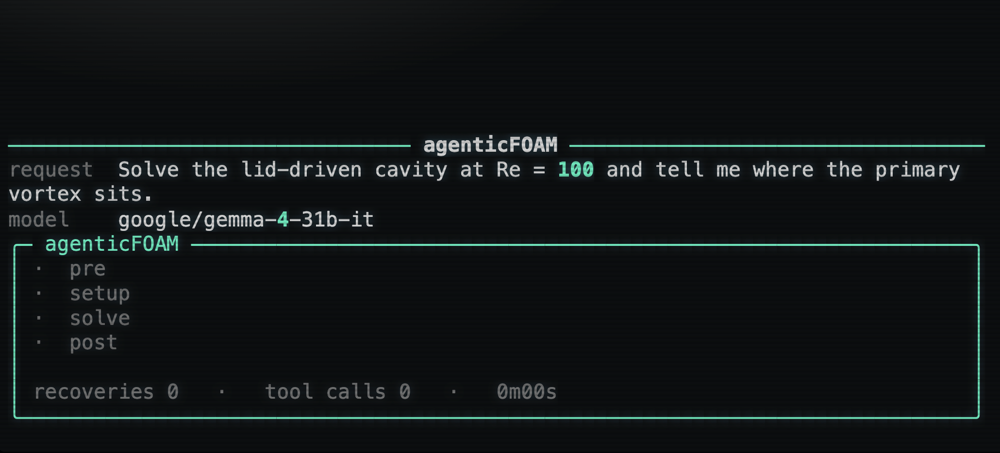

# agenticFOAM

A stage-gated agentic harness that runs the OpenFOAM lid-driven cavity
tutorial (`icoFoam`) end to end from a one-line request — plans the case,
builds the mesh, sets the physics, runs the solver to convergence, and
extracts the primary vortex — recovering from mesh-quality issues and
numerical instability on its own.

[](https://agenticfoam.netlify.app/)

Preview of the [agentic terminal interface](https://agenticfoam.netlify.app/).

## Quick start

```bash
pip install -e .                       # httpx, pydantic, pyyaml, rich
cat > .env <<'EOF'
OPENROUTER_API_KEY=sk-or-...
AGENTICFOAM_MODEL=google/gemma-4-31b-it   # our default
EOF
python -m agenticfoam.demo             # reference Re=100 run
```

Any request works:

```bash
python -m agenticfoam.demo "solve the cavity at Re=400 on a 30x30 mesh"
python -m agenticfoam.demo -m anthropic/claude-sonnet-4.5   # pick the model
```

Requires OpenFOAM v2412 on the machine (the harness shells out to `blockMesh`,
`icoFoam`, `postProcess`). Point `AGENTICFOAM_BASHRC` at a different install
if needed.


## Repo layout

```
agenticfoam/
  schema.py        CaseSpec · CaseState · StageResult · RunLedger (the data model)
  foam.py          run an OpenFOAM binary · parse solver logs · dict edits · snapshot/rollback
  tools.py         the action space + schema derivation + dispatcher
  analysis.py      streamfunction vortex locator
  gates.py         the 4 stage gates + the regime-aware convergence classifier
  stages.py        the per-stage executor sub-loop (brief -> tool calls -> gate -> retry)
  agents.py        planner (request -> CaseSpec)
  orchestrator.py  top-level flow · recovery ladder · the ledger
  llm.py           provider-neutral OpenRouter client (httpx, no SDK)
  report.py        the pinned-status-bar terminal reporter (+ plain fallback)
  demo.py          the showcase entrypoint
cases/cavity/      pristine vendored tutorial case (0/ constant/ system/)
runs/              ledgers and case snapshots (gitignored)
```
